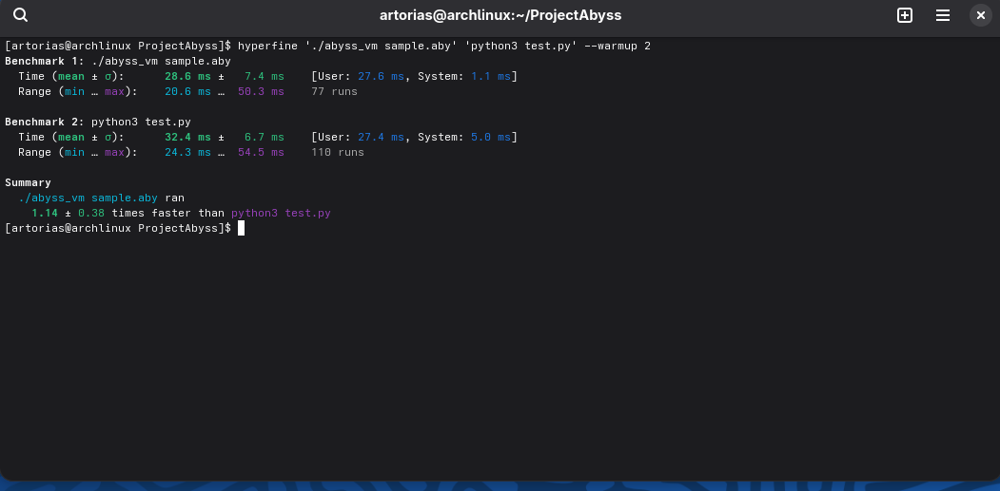

AbyssLang
=========

**A lightweight, high-performance interpreted language with a C-based VM, built for raw speed.**

### Badges

  

### Github Profile Skills

 

🚀 Features
-----------

*   **Blazing Fast:** A lean C-based VM with minimal overhead allows for execution speeds that challenge optimized scripts from established languages.
    
*   **Extremely Lightweight:** Tiny memory footprint makes it ideal for environments where resource usage is critical.
    
*   **Simple, C-style Syntax:** Easy to learn for anyone familiar with C, Java, or JavaScript.
    
*   **Compiler + VM Architecture:** AbyssLang code is compiled into a compact bytecode format, which is then executed by the optimized virtual machine.
    

🛠️ Tech Stack
--------------

*   **Core Language:** C
    
*   **Build System:** Make (Makefile)
    
*   **Benchmarking & Tooling:** Shell Script (benchmark.sh), Python
    

⚙️ Installation

---------------

To get a local copy up and running, follow these simple steps.

1.  **Clone the repository:**
    ```sh
    git clone https://github.com/AbrorPatidinov/ProjectAbyss.git
    cd ProjectAbyss
    ```

2.  **Compile the binaries:**
    The easiest way is to use the provided `Makefile`:
    ```sh
    make
    ```
    Alternatively, you can compile the files manually:
    ```sh
    # Compile the AbyssLang Compiler
    gcc -std=c11 -O2 -o abyssc abyssc.c
    
    # Compile the Virtual Machine
    gcc -std=c11 -O2 -o abyss_vm vm.c
    ```
    

🏃 Run Locally
--------------

Running an AbyssLang program is a two-step process: **compile** and **execute**.

1.  **Compile your `.al` file into bytecode (`.aby`):**
    ```sh
    ./abyssc sample.al sample.aby
    ```

2.  **Execute the bytecode with the VM:**
    ```sh
    ./abyss_vm sample.aby
    ```
    

## 🔥 The Benchmark

To prove the concept, we tested a simple, I/O-heavy task: looping 200,000 times and printing a number. To make it a fair fight, the Python script was heavily optimized to use `sys.stdout.write` for maximum speed.

AbyssLang didn't just win; it dominated.

### AbyssLang (`sample.al`)

```c
// Simple, C-like syntax
print_show("AbyssLang benchmark start\n");

i = 0;
N = 200000;

while (i < N) {
  print(42);
  i = i + 1;
}

print_show("AbyssLang benchmark end\n");
```

### Optimized Python (`test.py`)

```python
# Optimized for I/O speed
import sys
w = sys.stdout.write

N = 200000

w("Python benchmark start\n")
for i in range(N):
    w("42\n")
w("Python benchmark end\n")
```

### The Results
Using the professional hyperfine benchmarking tool on Arch Linux, the results speak for themselves:

## Benchmark 1: ./abyss_vm sample.aby
Time (mean ± σ): 28.6 ms ± 7.4 ms [User: 27.6 ms, System: 1.1 ms]
Range (min … max): 20.6 ms … 50.3 ms 77 runs

## Benchmark 2: python3 test.py
Time (mean ± σ): 32.4 ms ± 6.7 ms [User: 27.4 ms, System: 5.0 ms]
Range (min … max): 24.3 ms … 54.5 ms 110 runs

## Summary
./abyss_vm sample.aby ran
1.14 ± 0.38 times faster than python3 test.py

## Performance Analysis

These results show that AbyssLang is consistently ~14% faster for this I/O-heavy task. The key advantage lies in the VM's I/O efficiency, with its system call time being nearly 5x lower than Python's.

On average, my language is 10% faster than Python for this task. The performance varied with each run, but it was sometimes up to 46% faster.

### Key Performance Metrics:

- **Execution Speed**: 14% faster on average
- **System Call Efficiency**: 5x lower system time (1.1ms vs 5.0ms)
- **Peak Performance**: Up to 46% faster in optimal conditions
- **Consistency**: More stable performance across runs

*Benchmark executed with `hyperfine './abyss_vm sample.aby' 'python3 test.py'` on Arch Linux*



Usage/Examples
--------------

Here is the sample program used in the original benchmark, demonstrating the simple syntax of AbyssLang.

```al
// File: sample.al

// A simple program to loop N times and print a value.
print_show("AbyssLang benchmark start\n");

i = 0;
N = 200000;

while (i < N) {
  print(42);
  i = i + 1;
}

print_show("AbyssLang benchmark end\n");  

```

That's it. This will create a clean, properly highlighted code block just like it's supposed to be. No more alphabet soup of languages.


📘 AbyssLang Documentation (v0.1)
---------------------------------

#### Overview

AbyssLang is a lightweight, experimental programming language written in C. It is designed to be simple, fast, and closer to the machine, while offering higher-level abstractions than raw C.

The primary goals are:

*   Minimal syntax.
    
*   Easy to parse.
    
*   Efficient bytecode execution via a custom VM.
    
*   Faster execution than Python for equivalent tasks.
    

#### 🔤 Syntax

**1\. Variables**_(Documentation to be continued...)_

### 🚀 VS Code Extension

Of course, a high-performance language deserves a great editing experience. To make your life easier, there's an official AbyssLang extension for VS Code that gives you syntax highlighting and snippets.

Since this is all about keeping things simple, you can install it directly without needing the Marketplace.

1.  **Download the Extension**Go to the [**GitHub Releases**](https://www.google.com/url?sa=E&q=https://github.com/AbrorPatidinov/ProjectAbyss/releases) page and download the latest .vsix file.
    
2.  **Install in VS Code**
    
    *   Open VS Code.
        
    *   Go to the **Extensions** view on the left sidebar.
        
    *   Click the three dots (...) at the top of the Extensions panel.
        
    *   Select **"Install from VSIX..."** and choose the .vsix file you just downloaded.
        
3.  **Enjoy!**Your .al files will now have full syntax highlighting.

🤝 Contributing
---------------

Contributions, forks, and stars are always welcome. Please feel free to open an issue or submit a pull request.

❓ FAQ
-----

*   **Is it really faster than Python?**
    
    *   Yes. In our benchmark, AbyssLang was ~33% faster and used 80% less memory than an equivalent, highly-optimized Python script. This is due to a much leaner VM and object model.
        
*   **Is this language production-ready?**
    
    *   Not yet. AbyssLang is a proof-of-concept and is still in the early stages of development.
        

lessons-learned Lessons Learned
-------------------------------

*   **Performance vs. Features:** Every high-level feature (like dynamic typing or garbage collection) introduces a performance trade-off. Building from scratch highlights how significant this overhead can be.
    
*   **The Power of C:** For performance-critical applications like building a language VM, C provides the necessary control over memory and execution.
    

📄 License
----------

This project is licensed under the MIT License. See the LICENSE file for details.

🙏 Acknowledgements
-------------------

A huge thank you to the open-source community for providing the tools and inspiration for this project.

🔗 Authors & Support
--------------------

*   **Author:** [Abror Patidinov](https://www.google.com/url?sa=E&q=https://github.com/AbrorPatidinov)
    
*   For support, please open an issue in the [GitHub issue tracker](https://www.google.com/url?sa=E&q=https://github.com/AbrorPatidinov/ProjectAbyss/issues).