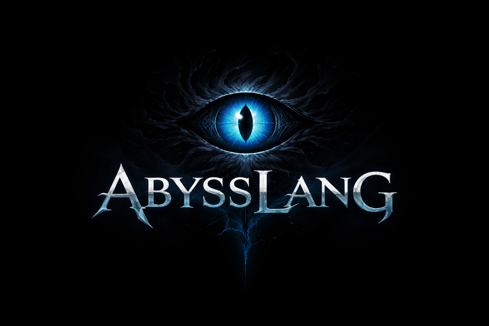

<p align="center">
  
</p>

# 🌌 AbyssLang

> A systems programming language forged in the abyss.

AbyssLang is a custom-built compiled language with its own:
- 🧠 Lexer
- 🧩 Parser
- ⚙️ Bytecode Compiler
- 🔥 Virtual Machine
- 👁️ Memory Visualizer (Abyss Eye)

Built from scratch in C.

---

## ✨ Features

- Static typing (int, float, char, str)
- Structs
- Arrays
- Functions with multiple return values
- Heap & stack allocation
- Manual memory management
- Exceptions (try/catch/throw)
- Custom bytecode VM
- Built-in benchmarking
- Memory introspection (Abyss Eye)

---

## 🚀 Example

```abyss
void main() {
    int start = clock();
    int sum = 0;

    for (int i = 0; i < 1000000; i++) {
        sum += i;
    }

    int end = clock();

    print("Sum: %{int}", sum);
    print("Elapsed: %{float} sec", (end - start) / 1000.0);
}
```

---

## 📊 Benchmarks (1,000,000 loop test)

| Language   | Time (sec) | Time (ms) |
|------------|------------|-----------|
| AbyssLang  | ~0.040     | ~40 ms    |
| Python     | ~0.089     | ~89 ms    |

Measured on Arch Linux (x86_64).

---

## 🛠 Build

```bash
make
./abyssc program.al program.aby
./abyss_vm program.aby
```

---

## 🧠 Why It Exists

AbyssLang was built as a deep systems project to explore:

- Compiler construction
- Virtual machine design
- Memory management
- Language architecture

Not a toy. Not a wrapper.  
A language born from first principles.

---

## 👤 Author

Built at 19 by Abror Patidinov.
